# Implementation Multilayer Perceptron (MLP)

These are my condensed notes on the basic theory of neural networks. It served for me as a foundation for implementing a neural network. Check the reference section for the books and articles I was using as learning material.

## Overview
A MLP is a mathematical function

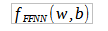

FFNN stands for Feed-forward neural network. `w` are the weights (weight matrices) of the connections and `b` are the biases added to the input of the activation function.

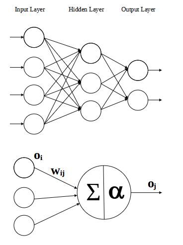

The neural net has an input layer representing the values of the feature vector and an output layer for the result value(s) and zero or more hidden layers. All neurons (nodes) are connected.

Output function for a neuron `j`:

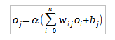

alpha is the activation function which is often the logistic function

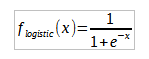

or the hyperbolic tangent

## Training

We feed the neural network with the feature vector of all samples in the training set and compare the result at the output layer with the corresponding test vector for each sample. The error values are backpropagated from one layer to the previous layer and used to update the weights between any two layers of the neural net. When all samples are processed, this step is repeated and repeated again, by randomly picking the samples from the same training set, until some finish criteria is met e.g., the classification accuracy rating was at it's peak. Data preprocessing and adding artificial training data could also improve the model.

Weight initialization:

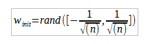

`n` is the number of the incoming connections (signals) to a neuron.

This is just one example. Other methods exist.

## Gradient descent

The goal is to minimize the error of the neural net by optimizing the `w` and `b` parameters in the error function. To know how to update the parameters, the **Gradient descent** method is applied.

As the loss function the mean squared error (MSE) divided by two is used here.

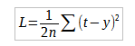

For a neuron `j` it is

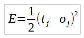

The gradient is calculated by determining the partial derivations for `w` and `b` of the selected error function.

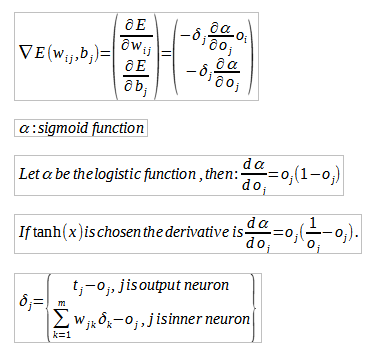

Not so obvious is what the error of an inner neuron could be, because only for the output neurons target values exist. So that's why there are two cases for calculating delta in the above formula.

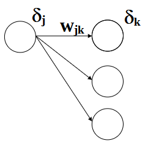

## Parameter adjustments

Assuming the logistic function was selected as the sigmoid function:

Update weight:

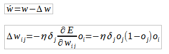

Update bias:

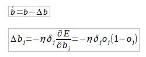

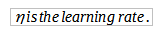

## Hyperparameters

So we know how a multilayer perceptron works, now. But there are also some parameters that we have to specify from outside, that are not part of the learning process:
- number of layers
- number of nodes on the hidden layers
- learning rate
- activation function
- weight (bias) initialization
- batch size
- epoch count

... and more.

There are some methods that help to select good hyperparameters but it also involves experimenting with a smaller training and validation set.

## Implementation

### Files

* _neuralnet.c_, _neuralnet.h_ - Implementation of a multilayer-perceptron (MLP)
* _example.c_ - Example application

### Compilation

gcc 7.5.0
~~~bash
gcc -O2 -Wall -Wextra -pedantic -o nn neuralnet.c example.c -lm
~~~

clang 6.0.0
~~~bash
clang -O2 -Wall -Wextra -pedantic -o nn neuralnet.c example.c -lm
~~~

Microsoft (R) C/C++ Compiler 19.23.28105.4
~~~bash
cl /O2 /TC neuralnet.c example.c /link /out:nn.exe
~~~

### Example ouput

#### [Fashion-MNIST](https://github.com/zalandoresearch/fashion-mnist)

~~~bash
[Epoch  0] Classification accuracy rate: 0.835000
[Epoch  1] Classification accuracy rate: 0.843300
[Epoch  2] Classification accuracy rate: 0.797700
[Epoch  3] Classification accuracy rate: 0.834200
[Epoch  4] Classification accuracy rate: 0.830300
[Epoch  5] Classification accuracy rate: 0.814200
[Epoch  6] Classification accuracy rate: 0.822900
[Epoch  7] Classification accuracy rate: 0.826800
[Epoch  8] Classification accuracy rate: 0.804400
...
~~~

#### [Original MNIST](http://yann.lecun.com/exdb/mnist/)

### Planned improvements
* input data preprocessing
* adaptive learning rate
* convolution
* pooling

## Literature Reference

 * [The Hundred-Page Machine Learning Book](http://themlbook.com/)
 * [Make Your Own Neural Network](https://makeyourownneuralnetwork.blogspot.com/)
 * [Finding the derivative of the error](https://en.wikipedia.org/wiki/Backpropagation#Finding_the_derivative_of_the_error)
